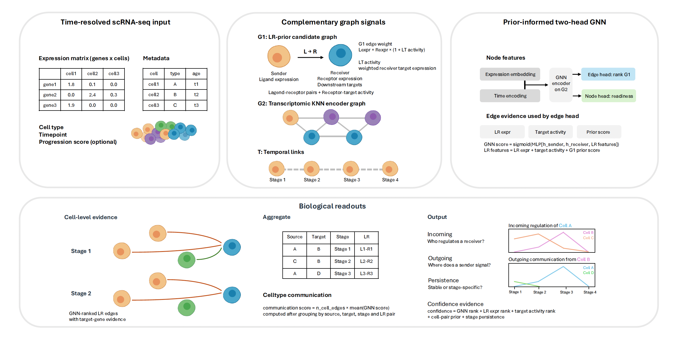

# DyCCC

DyCCC is a graph neural network framework that integrates ligand-receptor priors, ligand-target activity, and transcriptomic context to infer cell-cell communication from single-cell RNA-seq data.



## Input

DyCCC uses two input files:

```text
sampleid_metadata.csv
sampleid_expression.csv
```


## Prepare LR and NicheNet priors

Create the mouse LR table from LIANA consensus:

```bash
python pip install "liana>=1.7"
mkdir datacache
```

```python
import liana as li

lr = li.resource.select_resource("mouseconsensus")
keep = [c for c in ["ligand", "receptor", "resource", "references"] if c in lr.columns]
lr = lr[keep].dropna(subset=["ligand", "receptor"]).drop_duplicates()
lr.to_csv("datacache/liana_mouse_consensus.csv", index=False)
```

Download the mouse NicheNet v2 ligand-target prior from Zenodo and convert it:

```bash
wget -O datacache/nichenet_prior.rds \
  'https://zenodo.org/records/7074291/files/ligand_target_matrix_nsga2r_final_mouse.rds?download=1'

Rscript scripts/export_nichenet_prior.R \
  datacache/nichenet_prior.rds \
  datacache/nichenet_ligand_target.csv \
  100
```
## Run

Create yaml file:

```yaml
expression_path: data/sampleid_expression.csv
metadata_path: data/sampleid_metadata.csv
out_dir: output/sampleid

celltype_col: celltype
age_col: timepoint
seed: 22

lr_pairs_path: datacache/liana_mouse_consensus.csv
ligand_target_prior_path: datacache/nichenet_ligand_target.csv

readiness_target_path: data/readiness_target.csv
readiness_target_cell_col: cell
readiness_target_col: pseudotime

n_label_permutations: 20
n_lr_permutations: 0
lr_permutation_max_pairs: 500
```

Run:

```bash
PYTHONPATH=src python -m dyccc.pipeline \
  --config data.yaml
```

For a separate LR-pair stability check:

```bash
PYTHONPATH=src python -m dyccc.pipeline \
  --config data.yaml \
  --out-dir output/sampleid \
  --n-label-permutations 0 \
  --n-lr-permutations 5 
```

## Plot after training

```bash
PYTHONPATH=src python scripts/generate_dyccc_plots.py \
  --out-dir output/sampleid \
  --plot-parts line,readiness
```


